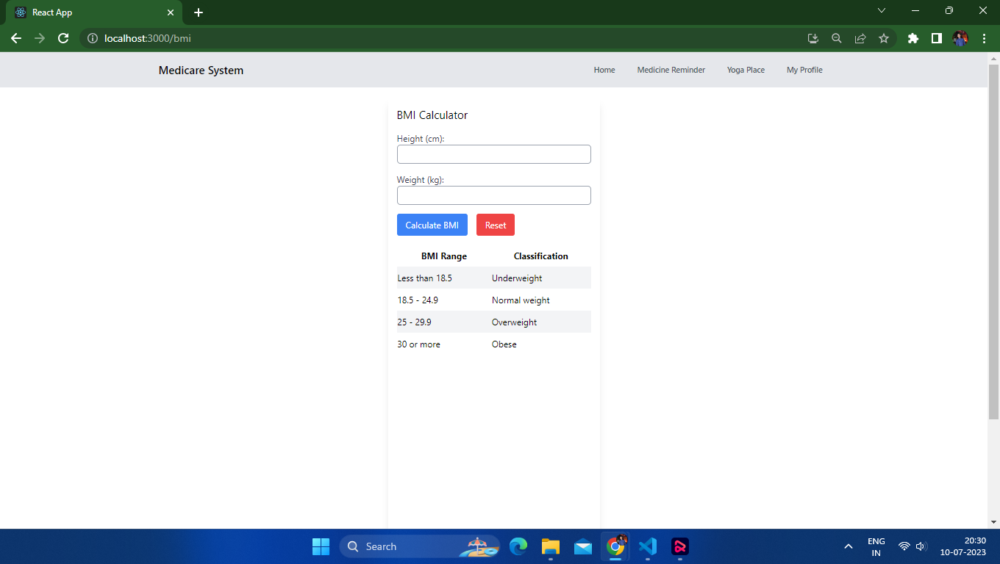

# Medicare System

The Medicare System is a user-friendly application designed to assist senior citizens in managing their health and wellness. It provides various features and functionalities to help users maintain a healthy lifestyle.

## Features

- **Medicine Tracker**: Keep track of your medications with our medicine tracker feature.

- **Account Settings**: Customize your profile settings to suit your preferences. Update personal information, manage notifications, and more.

- **Yoga Place**: Get a free subscription to our Yoga and Exercises section. Access a wide range of yoga asanas and exercises for you and your family.

- **BMI Calculator**: Calculate your Body Mass Index (BMI) to gain insights into your health. Monitor your weight and understand your overall fitness level.

- **Feedback**: Share your valuable feedback with us. We appreciate your input and strive to continually improve our services.

- **Connect with Others**: Join our community and connect with other members. Share experiences, ask questions, and engage in discussions related to health and wellness.

## Screenshots

Home page of medicare system include a hero section then service section including medicine tracker, Yoga place etc...

You can add the medicines you are taking and enter all the details like name, schedule and dosage.

You can calculate your BMI on this page and can get an overall idea of your current health condition.

On community you can send the friend request to the available person and can connect with him/her.

Your feedback is very important for us. You can send you valueable feedback on this page and we will work on based on your feedback.

This is the yoga page you can see a list of free yogas here and choose what yoga you want to learn and do.

On this page you will see the detailed discription available of selected yoga. Also this page includes a SEARCH ON GOOGLE button from where you can search more on that particular data.

This is the profile details page you can add your details on this page. These details will be saved on your local storage sp you can access it from your device.

## Technologies Used

- React: JavaScript library for building user interfaces.
- React Router: Declarative routing for React applications.
- Tailwind CSS: Utility-first CSS framework for styling.
- LocalStorage: Browser API for storing data locally.

## Installation

1. Clone the repository: `git clone https://github.com/Vishal08122001/medicare-system.git`
2. Navigate to the project directory: `cd medicare-system`
3. Install the dependencies: `npm install`
4. Start the application: `npm start`
5. Open your browser and visit: `http://localhost:3000`

## ThankYou!
